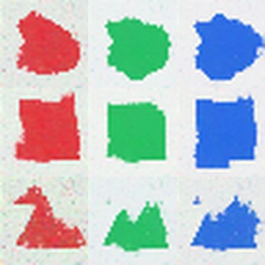

# Personal Image Model Studio

[](https://github.com/JasonStys/personal-image-model-studio/actions/workflows/validate.yml)

A local-first image-generation workbench with **actual custom diffusion training**, structured prompts, auditable datasets and a native desktop shell. This independently implemented successor replaces a large desktop prototype with focused Python services, a TypeScript interface and private SQLite metadata.

It does not generate placeholder images when no model exists. Train a fresh compact native model or explicitly register an authorized, compatible local classic Stable Diffusion export. No third-party artwork or pretrained weights are distributed here.



Rows: circle, square, triangle. Columns: red, green, blue. These samples came from real learned weights after 6,000 optimizer updates on owned procedural shapes—not a procedural renderer at inference time. The small model still produces rough edges and is **not a general-purpose or photorealistic generator**. See [validation evidence](docs/reports/validation.md), including exact runtime versions and limitations.

## Features

- Independent scene, style, tag, negative and subject fields; explicit `(phrase:1.4)` weights; optional experimental native subject boxes.
- Real from-scratch diffusion: learned caption vocabulary/embeddings, small UNet, held-out denoising evaluation, EMA weights, safe checkpoint reload and AdamW/RNG resume.
- Text generation, image-to-image editing, white-edit/black-preserve masks and centered aspect-ratio expansion. Known pixels are overlaid exactly at output; semantic quality remains model-dependent.
- Directory/ZIP ingestion with caption and metadata sidecars, provenance, pixel deduplication, deterministic train/validation splitting and physically separate AI-origin quarantine metadata.
- Classic single-encoder Stable Diffusion safe-tensor imports and real attention-only LoRA training. Supported families are explicit; arbitrary executable models are rejected.
- Human feedback, explicit revisions and consented feedback ZIP exports. Generated pixels keep their AI-origin labels; ordinary training excludes them. No hidden retraining or automatic score inflation.
- Reviewed tag glossary, transparent local phrase rules, private run reports, bounded job queue, cancellation and interrupted-run recovery.
- Prioritized read-only DeviantArt OAuth/PKCE connector for your own authorized gallery. Passwords stay in the provider browser; OAuth tokens stay in memory. Live account access requires your registered public client ID and authorization.
- Responsive browser UI and Windows portable native shell; shared browser interface is tested with Chromium, Firefox, WebKit and a mobile viewport. Native macOS/Linux packaging and mobile-native installers are not claimed.

## Run locally

Python 3.12 and Node 24 are the reference toolchains. Choose an isolated environment; ML dependencies are substantial. CPU works without Docker. For a compatible GPU build, consult the official PyTorch installer and verify the version/driver combination rather than silently replacing system drivers.

```bash
python -m venv .venv
# Activate .venv using your operating system's normal activation command.
python -m pip install -e ".[dev,ml,desktop]"
npm ci
npm run build
python -m studio.cli --port 8016
```

Open the private local session link printed by the launcher. It contains an ephemeral token: **do not share it**. For a desktop window use `python -m studio.cli --desktop`. To build a portable native shell, run `python scripts/build_desktop.py` after the UI build. Launch its `PersonalImageModelStudio.exe`, then select your trusted installed ML Python executable under Method & limits. The shell includes the UI/API, not ML weights, GPU drivers or a universal one-file ML installer.

[Installation and packaging](docs/installation.md) · [Walkthrough](docs/user-guide.md) · [DeviantArt setup](docs/deviantart.md)

## Reproduce validation

```bash
python -m pytest tests/test_core.py tests/test_deviantart.py tests/test_jobs.py
python -m pytest tests/test_ml.py
python -m ruff check studio scripts tests
python -m ruff format --check studio scripts tests
npm run build
node scripts/code_index.mjs --check
npm run test:browser
# RUN_ML_BROWSER=1 selects the separate real browser-to-ML-worker test.
python scripts/train_demo.py --root artifacts/my-demo --steps 6000 --device auto
```

Demo outputs/checkpoints are local and ignored by Git. Use a new output directory; existing models are never overwritten. CI repeats contract tests on three OSes/two Python versions, real CPU training/resume/LoRA and browser-worker tests, four browser profiles, dependency audits and Windows packaging. CI is not a GPU quality evaluation or proof of compatibility with every device/model.

## Layout and file responsibilities

| File/group | Responsibility |
| --- | --- |
| `studio/contracts.py` | Closed bounded input schemas and cross-field validation. |
| `studio/api.py` | Private loopback API, provenance, runtime selection and artifact routes. |
| `studio/cli.py` | Browser/native launch and private per-process session. |
| `studio/prompts.py` | Numeric weight syntax, independent sections and phrase policy. |
| `studio/files.py` | Atomic JSON, hashes, confinement and metadata-stripping raster decode. |
| `studio/datasets.py` | Safe local/ZIP import, deduplication, splits, AI exclusion and owned fixtures. |
| `studio/model.py` | Fresh word vocabulary, weighted text/time conditioning and compact denoiser. |
| `studio/training.py` | Actual native optimization, held-out metrics, EMA and continuation. |
| `studio/checkpoints.py` | Fixed-architecture safe-tensor manifests, integrity and optimizer recovery. |
| `studio/native.py` | Learned DDIM sampling, regions and source-preserving edits. |
| `studio/formats.py` | Fixed pretrained classes, file budgets and base-model fingerprints. |
| `studio/pretrained.py` | Offline classic SD generation and real LoRA adapter training. |
| `studio/jobs.py`, `worker.py` | Serialized bounded subprocess lifecycle and trusted dispatch. |
| `studio/store.py` | Parameterized short-lived SQLite connections and quarantine database. |
| `studio/feedback.py` | Explicit latest-consent AI-labelled feedback export. |
| `studio/deviantart.py` | Own-gallery OAuth/PKCE, memory credentials, bounded metadata/raster downloads. |
| `studio/__init__.py` | Package marker. |
| `web/main.ts`, `api.ts`, `types.ts`, `style.css` | Workspace UI, private transport, browser contracts, accessible responsive styling. |
| `index.html`, `tsconfig.json`, `package*.json`, `pyproject.toml` | Entry document, strict compilation, locked browser dependencies and Python extras. |
| `scripts/train_demo.py` | Real fresh training and learned sample contact sheet. |
| `scripts/build_desktop.py`, `desktop_entry.py` | Native portable shell packaging/entry. |
| `scripts/code_index.mjs`, `python_index.py` | Reproducible exact declaration/variable line headers and detailed code map. |
| `tests/test_core.py`, `test_deviantart.py`, `test_jobs.py`, `test_ml.py` | Core/privacy/property, mocked provider-contract, lifecycle and real ML regression tests. |
| `tests/browser*.spec.ts`, `playwright.config.ts` | Real browser accessibility/portability and separate real ML-worker workflow. |
| `.github/workflows/validate.yml` | Least-privilege pinned CI, scheduled audits and evidence artifacts. |
| `requirements-cpu-audit.txt` | Upstream advisory lookup for pinned official CPU-wheel releases; not an installer. |
| `scripts/publish_evidence.py`, `.gitattributes` | Guarded synthetic-only public evidence export and stable text line endings. |
| `docs/` | Architecture, requirements traceability, threats, complexity, research, operating instructions and validation reports. |
| `.gitignore`, `LICENSE` | Private-artifact exclusions and software license. |

[Detailed source map](docs/code-map.json) includes each declaration, argument/local variable, actual line and source-derived purpose. Header indexes are generated and checked in CI so line references cannot silently drift.

## Scope and responsible use

Use only data/models you own or are permitted to process and train on. Account access is not a copyright/license grant. AI-origin detection uses explicit labels—not an infallible visual detector. A human checks captions, rights, image quality and safety. This local single-user app is not hardened multi-tenant hosting; it must not be exposed to a public network. The [requirements matrix](docs/requirements.md) explicitly separates preserved capabilities, changed mechanisms and unfinished prototype ideas.
